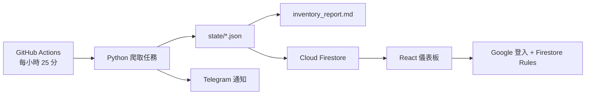

# Card Radar

Card Radar 是一套 Weiss Schwarz 商品監控系統。GitHub Actions 定期抓取多個商店的在庫商品，將狀態保存於 Git，透過 Telegram 通知新品，並把整理後的資料同步到受 Google 登入保護的 Firebase 儀表板。

## 主要功能

- 每小時由 GitHub Actions 喚醒；各商店任務以 UTC 日期限制為每天成功執行一次。
- 監控新品與在庫狀態，抓取或解析異常時保留舊基準，避免誤報大量下架。
- 透過 Telegram 發送首次建立基準與新品通知。
- 自動產生 [`inventory_report.md`](inventory_report.md) 靜態清單。
- 將商品、來源、同步紀錄與異動事件寫入 Cloud Firestore。
- 提供 React + Firebase Hosting 儀表板，支援一般商品／Deck 販售分類、價格、搜尋、來源／狀態篩選及即時更新。

## 系統流程



## 監控來源

| 來源 | 追蹤範圍 |
| --- | --- |
| square-bushiroad | 商品分類 668、284，以及 WS 牌組販售 |
| torecolo | Weiss Schwarz 新品與牌組販售 |
| manasource | 商品分類 2268 |
| cardmax | 手機版商品分類 ct1849，包含含稅售價 |
| gurapan | 商品分類 1081 與牌組販售 |
| c-labo | 商品分類 2421 的有庫存商品與牌組販售 |
| 福福トレカ | WS 牌組販售 |
| Hobby Station | WS 牌組販售 |

CardShop-Serra 已停止販售 Weiss Schwarz，因此不再抓取；同步時也會清除其舊 Firestore 文件。

## 快速開始

需求：Python 3.12、Node.js 22、npm。

```bash
python3 -m venv .venv
source .venv/bin/activate
pip install -r requirements.txt

python -m unittest discover -s tests -v

cd web
npm ci
npm run dev
```

`npm run dev` 會先把 `state/*.json` 匯出成忽略版控的 `web/public/demo-data.json`，因此不需要 Firebase 也能在本機預覽。正式建置會先刪除這個檔案，避免把監控資料當成公開靜態資源部署。

## 常用指令

```bash
# 執行所有任務；需要通知時必須先設定 Telegram 環境變數
TG_BOT_TOKEN=xxx TG_CHAT_ID=yyy python run_all.py

# 只更新靜態報告
python tasks/inventory_report.py

# 前端型別檢查與正式建置
cd web && npm run build

# 檢查正式依賴漏洞
cd web && npm audit --omit=dev --audit-level=high
```

`run_all.py` 會自動探索 `tasks/` 下具有 `main()` 的模組，依 `ORDER` 與檔名排序。單一任務失敗不會阻止後續任務，但整體程序最後會回傳失敗，讓 CI 正確標示異常。

## GitHub 設定

在 repository 的 **Settings → Secrets and variables → Actions** 設定：

| 名稱 | 類型 | 用途 |
| --- | --- | --- |
| `TG_BOT_TOKEN` | Secret | Telegram Bot token |
| `TG_CHAT_ID` | Secret | Telegram chat id |
| `FIREBASE_SERVICE_ACCOUNT` | Secret | 專用 service account JSON 完整內容 |
| `FIREBASE_PROJECT_ID` | Variable | Firebase project id |
| `FIREBASE_API_KEY` | Variable | Firebase Web App API key |
| `FIREBASE_AUTH_DOMAIN` | Variable | Firebase Authentication domain |
| `FIREBASE_APP_ID` | Variable | Firebase Web App app id |

完整 Firebase 建置流程請參考 [`docs/firebase-setup.md`](docs/firebase-setup.md)，排程、故障排除及新增任務方式請參考 [`docs/operations.md`](docs/operations.md)。

## 專案結構

```text
automation/
├── lib/                    # 抓取、通知及資料正規化共用程式
├── tasks/                  # 爬取、報告與 Firestore 同步任務
├── scripts/                # 儀表板本機預覽資料匯出
├── state/                  # 任務基準資料，由 Actions 自動更新
├── tests/                  # 離線 HTML fixtures 與 parser 測試
├── web/                    # React + Vite 儀表板
├── docs/                   # Firebase 與維運文件
├── firestore.rules         # Firestore 存取控制
├── firebase.json           # Hosting、安全標頭與部署設定
├── inventory_report.md     # 自動產生的目前商品清單
└── run_all.py              # 自動探索並執行所有任務
```

## 安全原則

- Telegram token 與 service account JSON 只能存放於 GitHub Secrets 或本機安全憑證路徑。
- Firebase Web API key 不是伺服器密鑰；資料權限由 Authentication、`admins/{uid}` 與 Firestore Rules 控制。
- 瀏覽器端只能讀取允許的集合，所有寫入都由 Firebase Admin SDK 執行。
- GitHub Actions 使用最小權限，外部 action 以完整 commit SHA 固定版本。
